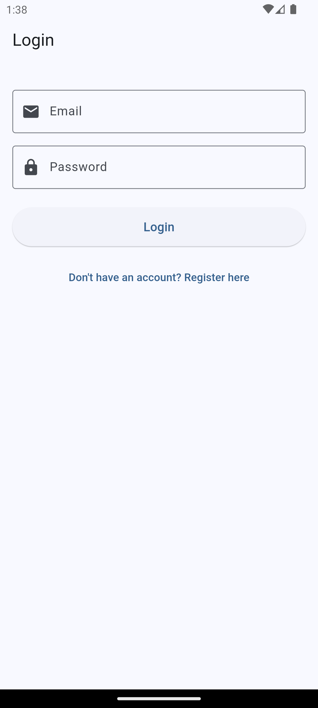
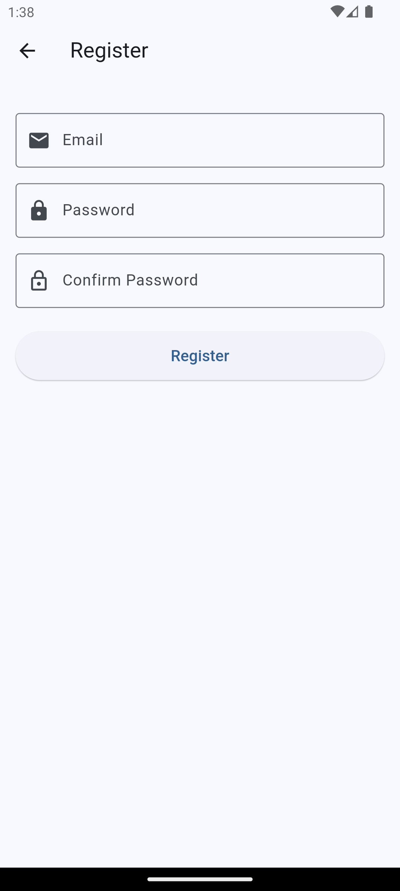

# Firebase Authentication Demo

A Flutter application demonstrating Firebase Authentication with Riverpod state management and unit testing.

## Features

- Firebase Authentication
  - Email/password sign in and registration
  - Secure authentication state management
  - Proper error handling for auth scenarios (invalid email, wrong password, etc.)
- User Interface
  - Clean login and registration forms with validation
  - Loading states during authentication
  - Error message display for user feedback
  - Intuitive navigation between screens
- State Management
  - Riverpod-based auth state management
  - Persistent authentication state
  - Clean separation of business logic
- Testing
  - Unit tests for authentication logic
  - Widget tests for login and home screens
  - Mocked Firebase Auth using Mocktail
- Security
  - Secure password handling
  - Protected routes based on auth state
  - Proper logout functionality

## Screenshots

<div style="display: flex; justify-content: space-between;">
  
  
  
</div>

## Prerequisites

- Flutter SDK (3.19.0 or higher)
- Dart SDK (3.5.4 or higher)
- Firebase project setup
- Android Studio / VS Code with Flutter extensions

## Getting Started

### Firebase Setup

1. Create a new Firebase project at [Firebase Console](https://console.firebase.google.com/)
2. Enable Email/Password Authentication:
   - In Firebase Console, go to Authentication > Sign-in method
   - Enable Email/Password sign-in
3. Install required CLI tools:
   ```bash
   # Install Firebase CLI if not already installed
   npm install -g firebase-tools
   
   # Install FlutterFire CLI
   dart pub global activate flutterfire_cli
   
   # Add pub cache to PATH (add to your shell config file for persistence)
   export PATH="$PATH":"$HOME/.pub-cache/bin"
   ```
4. Generate Firebase configuration:
   ```bash
   # Login to Firebase (if not already logged in)
   firebase login
   
   # Generate firebase_options.dart and configure platforms
   flutterfire configure
   ```
   - Select your Firebase project from the list
   - Choose the platforms you want to support (Android/iOS)
   - This will generate `lib/firebase_options.dart`
5. Add your platform-specific configuration files:
   - For Android: Place `google-services.json` in `android/app/`
   - For iOS: Place `GoogleService-Info.plist` in `ios/Runner/`
   
Note: The `firebase_options.dart` file contains your Firebase project configuration and is required for the app to connect to Firebase. The platform-specific configuration files can be downloaded from the Firebase Console after registering your apps.

### Installation

1. Clone the repository:
```bash
git clone https://github.com/ChrisViljoen/firebase_auth_demo.git
cd firebase_auth_demo
```
2. Install dependencies:
```bash
flutter pub get
```
3. Generate necessary files:
```bash
flutter pub run build_runner build --delete-conflicting-outputs
```

### Running the App

```bash
flutter run
```

## Testing

### Running Unit Tests

The project includes unit tests for authentication logic and widget tests for screens using Mocktail for mocking Firebase Auth:

```bash
flutter test
```

Test files:
- `test/login_screen_test.dart` - Login screen widget and integration tests
- `test/home_screen_test.dart` - Home screen widget and logout tests

## Project Structure

- `lib/`
  - `providers/` - Riverpod providers for state management
    - `auth_provider.dart` - Authentication state management
  - `screens/` - Application screens
    - `login_screen.dart` - User login interface
    - `register_screen.dart` - User registration interface
    - `home_screen.dart` - Main authenticated user interface
  - `main.dart` - Application entry point
  - `firebase_options.dart` - Auto-generated by Firebase CLI, contains platform-specific Firebase configuration. Do not modify manually.

## Dependencies

### Production Dependencies
- `firebase_auth: ^4.16.0` - Firebase Authentication
- `firebase_core: ^2.32.0` - Firebase Core functionality
- `flutter_riverpod: ^2.6.1` - State management
- `riverpod: ^2.6.1` - Core Riverpod functionality
- `riverpod_annotation: ^2.6.1` - Code generation for Riverpod
- `cupertino_icons: ^1.0.8` - iOS-style icons

### Development Dependencies
- `mocktail: ^1.0.4` - Mocking for unit tests
- `flutter_lints: ^3.0.1` - Lint rules for clean code
- `build_runner` - Code generation tool

## Contributing

1. Fork the repository
2. Create your feature branch (`git checkout -b feature/amazing-feature`)
3. Commit your changes (`git commit -m 'Add some amazing feature'`)
4. Push to the branch (`git push origin feature/amazing-feature`)
5. Open a Pull Request

## License

This project is licensed under the MIT License - see the [LICENSE](LICENSE) file for details.